<!-- Generated by scripts/gen_docs.py. Do not edit; run `python3 scripts/gen_docs.py`. -->

# Crate graph

Workspace dependencies only. Backends depend on core; core never
depends on a backend, which is what keeps it language-free.

```mermaid
graph TD
  balaur[balaur]
  balaur_android[balaur_android]
  balaur_anim[balaur_anim]
  balaur_apple[balaur_apple]
  balaur_audio[balaur_audio]
  balaur_bench[balaur_bench]
  balaur_cli[balaur_cli]
  balaur_core[balaur_core]
  balaur_export[balaur_export]
  balaur_gamend[balaur_gamend]
  balaur_http[balaur_http]
  balaur_input[balaur_input]
  balaur_physics[balaur_physics]
  balaur_platform[balaur_platform]
  balaur_plugin[balaur_plugin]
  balaur_render[balaur_render]
  balaur_script[balaur_script]
  balaur_script_rune[balaur_script_rune]
  balaur_ui[balaur_ui]
  balaur_web[balaur_web]
  balaur_websocket[balaur_websocket]
  balaur_webtransport[balaur_webtransport]
  balaur --> balaur_anim
  balaur --> balaur_apple
  balaur --> balaur_audio
  balaur --> balaur_core
  balaur --> balaur_gamend
  balaur --> balaur_http
  balaur --> balaur_input
  balaur --> balaur_physics
  balaur --> balaur_platform
  balaur --> balaur_plugin
  balaur --> balaur_render
  balaur --> balaur_script
  balaur --> balaur_script_rune
  balaur --> balaur_ui
  balaur --> balaur_web
  balaur --> balaur_websocket
  balaur --> balaur_webtransport
  balaur_android --> balaur
  balaur_anim --> balaur_core
  balaur_anim --> balaur_plugin
  balaur_anim --> balaur_script
  balaur_apple --> balaur_core
  balaur_apple --> balaur_platform
  balaur_apple --> balaur_plugin
  balaur_apple --> balaur_script
  balaur_audio --> balaur_core
  balaur_audio --> balaur_plugin
  balaur_audio --> balaur_script
  balaur_bench --> balaur
  balaur_bench --> balaur_core
  balaur_bench --> balaur_physics
  balaur_bench --> balaur_script
  balaur_bench --> balaur_script_rune
  balaur_cli --> balaur
  balaur_cli --> balaur_export
  balaur_core --> balaur_script
  balaur_export --> balaur
  balaur_gamend --> balaur_core
  balaur_gamend --> balaur_plugin
  balaur_gamend --> balaur_script
  balaur_http --> balaur_core
  balaur_http --> balaur_plugin
  balaur_http --> balaur_script
  balaur_input --> balaur_core
  balaur_input --> balaur_plugin
  balaur_input --> balaur_script
  balaur_physics --> balaur_core
  balaur_physics --> balaur_plugin
  balaur_physics --> balaur_script
  balaur_platform --> balaur_core
  balaur_platform --> balaur_plugin
  balaur_platform --> balaur_script
  balaur_plugin --> balaur_core
  balaur_plugin --> balaur_script
  balaur_render --> balaur_core
  balaur_render --> balaur_input
  balaur_render --> balaur_plugin
  balaur_render --> balaur_script
  balaur_render --> balaur_ui
  balaur_script_rune --> balaur_core
  balaur_script_rune --> balaur_script
  balaur_ui --> balaur_core
  balaur_ui --> balaur_plugin
  balaur_ui --> balaur_script
  balaur_web --> balaur_core
  balaur_web --> balaur_plugin
  balaur_web --> balaur_script
  balaur_websocket --> balaur_core
  balaur_websocket --> balaur_plugin
  balaur_websocket --> balaur_script
  balaur_webtransport --> balaur_core
```

